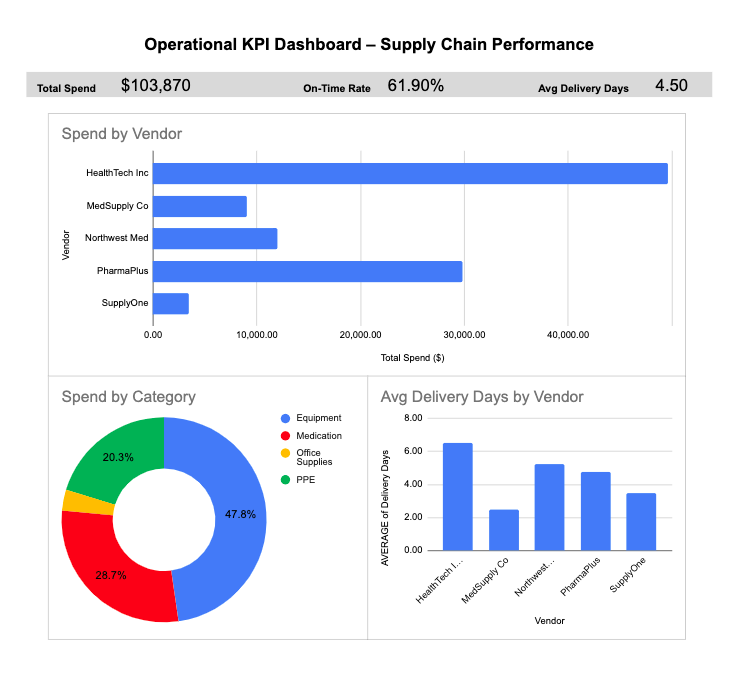

# Operational KPI Dashboard – Supply Chain Performance

## Overview
This project demonstrates a simple operational dashboard built to track supply chain performance metrics and support decision-making.

## KPIs Tracked
- Total Spend
- On-Time Delivery Rate
- Average Delivery Days

## Dashboard Preview

## Tools Used
- Google Sheets (Data and dashboard build)
- Excel export (.xlsx)
- GitHub (Project documentation)

## Notes
All data is simulated for portfolio purposes (no real patient or company data).
